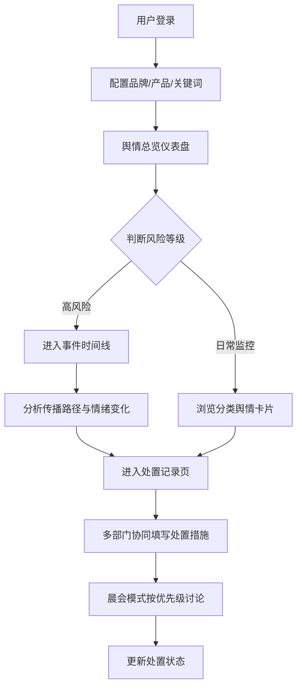

## 1. 产品概述

面向消费品企业公关与质量负责人的 Web 舆情指挥台，聚焦产品召回事件从传闻到官方公告全过程的声量变化追踪与处置协同。

- 核心价值：将分散在各平台的舆情信息结构化呈现，辅助决策层快速判断风险等级，协调公关、法务、客服多部门协同处置
- 目标用户：消费品企业公关总监、质量负责人、品牌危机管理团队

## 2. 核心功能

### 2.1 用户角色
| 角色 | 登录方式 | 核心权限 |
|------|----------|----------|
| 公关/质量负责人 | 账号密码登录 | 配置品牌信息、查看全部舆情、编辑处置记录、导出报告 |
| 公关专员 | 账号密码登录 | 查看舆情、填写处置记录、标记待跟进项 |
| 法务/客服 | 账号密码登录 | 查看相关舆情、填写本部门处置进度 |

### 2.2 功能模块
1. **舆情总览页**：品牌配置入口、多维度声量指标、分类舆情卡片、热度趋势、升降预警
2. **事件时间线页**：按时间轴展示关键节点、传播路径追踪、情绪占比变化曲线
3. **处置记录页**：多部门协同填写、风险等级分类、晨会视图、进度追踪

### 2.3 页面详情
| 页面名称 | 模块名称 | 功能描述 |
|----------|----------|----------|
| 舆情总览 | 品牌配置面板 | 录入品牌名称、产品型号、批次号、召回关键词、竞品名称 |
| 舆情总览 | 声量仪表盘 | 展示总声量、正面/负面/中性占比、环比变化、风险等级评估 |
| 舆情总览 | 平台分布 | 按新闻/短视频/论坛/社交平台分栏展示声量与情绪分布 |
| 舆情总览 | 地区热力 | 按省份/地区展示舆情热度分布 |
| 舆情总览 | 分类舆情卡片 | "投诉集中""媒体跟进""谣言扩散""官方回应"等分类卡片，显示内容摘要与热度升降标识 |
| 舆情总览 | 竞品对比 | 展示指定竞品在同期的相关声量对比 |
| 事件时间线 | 时间轴视图 | 从舆情萌芽→扩散→高峰→官方回应→回落的关键节点时间轴 |
| 事件时间线 | 传播节点详情 | 展示某条投诉何时被大号转发、哪家媒体引用、KOL参与情况 |
| 事件时间线 | 情绪趋势曲线 | 展示随时间变化的正面/负面/中性占比曲线，标注官方回应时点 |
| 事件时间线 | 关键事件卡片 | 置顶展示高影响力事件（10W+阅读、官媒报道等） |
| 处置记录 | 风险分级列表 | 按高/中/低风险等级分组展示待处置事项 |
| 处置记录 | 处置表单 | 多部门协同填写：已发布声明、已联系媒体、待核实说法、客服口径等 |
| 处置记录 | 晨会视图 | 一键切换晨会模式，按优先级展示当日需讨论事项 |
| 处置记录 | 进度追踪 | 展示各处置事项的状态流转、负责人、截止时间 |

## 3. 核心流程

用户登录后先配置品牌与召回关键词，系统基于模拟数据生成舆情总览。用户可在总览页快速判断当前风险，进入时间线追踪事件传播脉络，在处置记录页协同多部门填写应对措施。每日晨会切换至晨会视图快速过项。

## 4. 用户界面设计

### 4.1 设计风格
- **主色调**：深海军蓝 (#0A1628) 作为背景主色，传达专业、稳重、可信赖的危机管理氛围
- **强调色**：警报红 (#FF4D4F) 用于高风险标识，琥珀橙 (#FA8C16) 用于中风险/热度上升，翡翠绿 (#52C41A) 用于正面/下降趋势，信息蓝 (#1890FF) 用于中性数据
- **按钮风格**：直角微圆角 (4px)，扁平设计，悬停有微妙的发光效果
- **字体**：标题使用 "Noto Serif SC" 衬线字体传达权威感，正文使用 "Noto Sans SC" 无衬线保证可读性
- **布局风格**：暗色主题仪表盘布局，信息密度高但层次分明，卡片式分区，左侧导航栏
- **图标风格**：线性图标，2px 线宽，颜色跟随语义

### 4.2 页面设计概览
| 页面名称 | 模块名称 | UI 元素 |
|----------|----------|----------|
| 舆情总览 | 声量仪表盘 | 深色背景+渐变发光数字、环形进度图、带升降箭头的趋势指标 |
| 舆情总览 | 分类舆情卡片 | 卡片式布局、左上角风险色条、热度标签 (↑↓)、悬停微上浮效果 |
| 舆情总览 | 平台/地区分布 | 横向柱状图、色块填充、悬停显示详情 |
| 事件时间线 | 时间轴 | 垂直时间轴、节点带发光圆点、事件卡片左右交错排列 |
| 事件时间线 | 情绪曲线 | 面积图、三色叠加、关键事件垂直标注线 |
| 处置记录 | 风险分级 | 三色分栏布局、拖拽排序、卡片带进度条 |
| 处置记录 | 晨会视图 | 极简模式、大字号优先级序号、聚焦待决策项 |

### 4.3 响应式
- Desktop-first 设计，优化 1440px 及以上分辨率
- 平板端：左侧导航收起为图标栏，卡片自适应两列
- 移动端：导航转为底部 Tab 栏，卡片单列堆叠

### 4.4 动效设计
- 页面加载：数字从 0 滚动到目标值、卡片依次淡入上滑
- 热度变化：上升箭头红色脉动动画、下降箭头绿色呼吸动画
- 时间线滚动：节点依次点亮发光
- 悬停交互：卡片 4px 上浮 + 微光外发光
