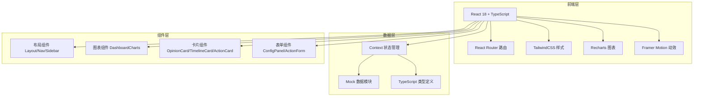

## 1. 架构设计



## 2. 技术说明
- 前端框架：React@18 + TypeScript@5
- 构建工具：Vite@5
- 样式方案：TailwindCSS@3
- 图表库：Recharts@2
- 动效库：Framer Motion@11
- 路由：React Router Dom@6
- 状态管理：React Context + useReducer
- 数据来源：前端 Mock 数据（模拟真实舆情场景）

## 3. 路由定义
| 路由 | 用途 |
|------|------|
| /dashboard | 舆情总览页（首页） |
| /timeline | 事件时间线页 |
| /actions | 处置记录页 |

## 4. 数据模型

### 4.1 核心类型定义

```typescript
// 品牌配置
interface BrandConfig {
  id: string;
  brandName: string;
  productModels: string[];
  batchNumbers: string[];
  recallKeywords: string[];
  competitors: string[];
}

// 舆情条目
interface OpinionItem {
  id: string;
  title: string;
  content: string;
  source: 'news' | 'video' | 'forum' | 'social';
  platform: string;
  region: string;
  sentiment: 'positive' | 'negative' | 'neutral';
  category: 'complaint' | 'media' | 'rumor' | 'official';
  heat: number;
  heatTrend: 'up' | 'down' | 'flat';
  author: string;
  authorLevel: 'kols' | 'media' | 'normal';
  publishTime: string;
  viewCount: number;
  commentCount: number;
  shareCount: number;
}

// 时间线节点
interface TimelineNode {
  id: string;
  time: string;
  type: 'seed' | 'spread' | 'peak' | 'response' | 'decline';
  title: string;
  description: string;
  importance: 'high' | 'medium' | 'low';
  opinionIds: string[];
}

// 情绪趋势数据点
interface SentimentPoint {
  time: string;
  positive: number;
  negative: number;
  neutral: number;
  total: number;
}

// 处置记录
interface ActionRecord {
  id: string;
  title: string;
  description: string;
  riskLevel: 'high' | 'medium' | 'low';
  department: 'pr' | 'legal' | 'cs' | 'qa';
  status: 'pending' | 'in_progress' | 'done';
  owner: string;
  createdAt: string;
  deadline: string;
  relatedOpinionIds: string[];
  updates: ActionUpdate[];
}

interface ActionUpdate {
  id: string;
  time: string;
  operator: string;
  content: string;
}
```

## 5. 项目目录结构

```
src/
├── types/              # TypeScript 类型定义
│   └── index.ts
├── data/               # Mock 数据
│   ├── brandConfig.ts
│   ├── opinions.ts
│   ├── timeline.ts
│   ├── sentiment.ts
│   └── actions.ts
├── context/            # 全局状态
│   └── AppContext.tsx
├── components/
│   ├── layout/         # 布局组件
│   │   ├── Sidebar.tsx
│   │   ├── Header.tsx
│   │   └── Layout.tsx
│   ├── dashboard/      # 舆情总览组件
│   │   ├── BrandConfigPanel.tsx
│   │   ├── StatCard.tsx
│   │   ├── SentimentRing.tsx
│   │   ├── PlatformChart.tsx
│   │   ├── RegionHeatmap.tsx
│   │   ├── OpinionCard.tsx
│   │   └── CompetitorCompare.tsx
│   ├── timeline/       # 时间线组件
│   │   ├── TimelineNode.tsx
│   │   ├── SentimentTrendChart.tsx
│   │   └── KeyEventCard.tsx
│   └── actions/        # 处置记录组件
│       ├── RiskColumn.tsx
│       ├── ActionCard.tsx
│       ├── ActionForm.tsx
│       └── MorningMeetingView.tsx
├── pages/
│   ├── Dashboard.tsx
│   ├── Timeline.tsx
│   └── Actions.tsx
├── App.tsx
├── main.tsx
└── index.css
```
